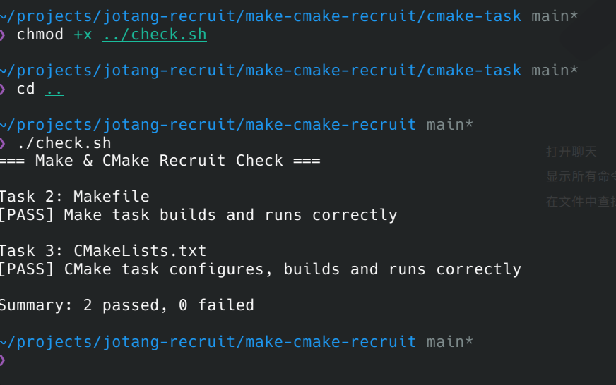

# Task 4：思考题

## 1. Make 和简单的 build.sh 有什么区别？

make更智能。  
1.多次编译时，make能做到不编译没修改的文件，.sh文件总会全部编译。
2.make有自己的语法。
3..PHONY能声明假目标。

## 2. CMake 是编译器吗？

执行 `cmake --build build` 时，最终是谁在编译 C 源文件？

不是。  
如果没有指定，cmake会自动选择path中合适的编译器。这个编译器来编译。

## 3. 为什么不希望每次都重新编译所有 `.c` 文件？

没有必要。只要被更改的文件和剩余文件没有依赖关系，再编译一次也是得到相同的产物。不重复编译能节约时间。
## 4.运行结果
